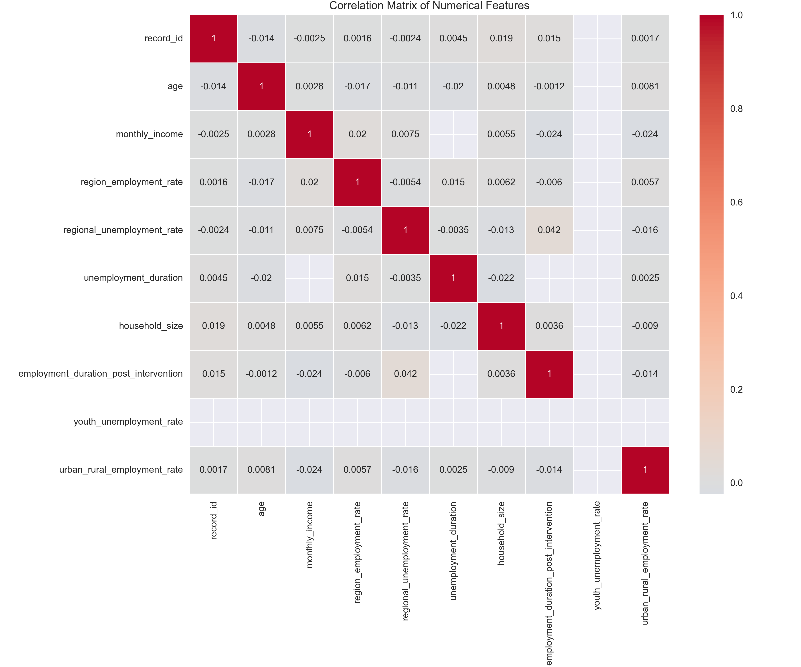
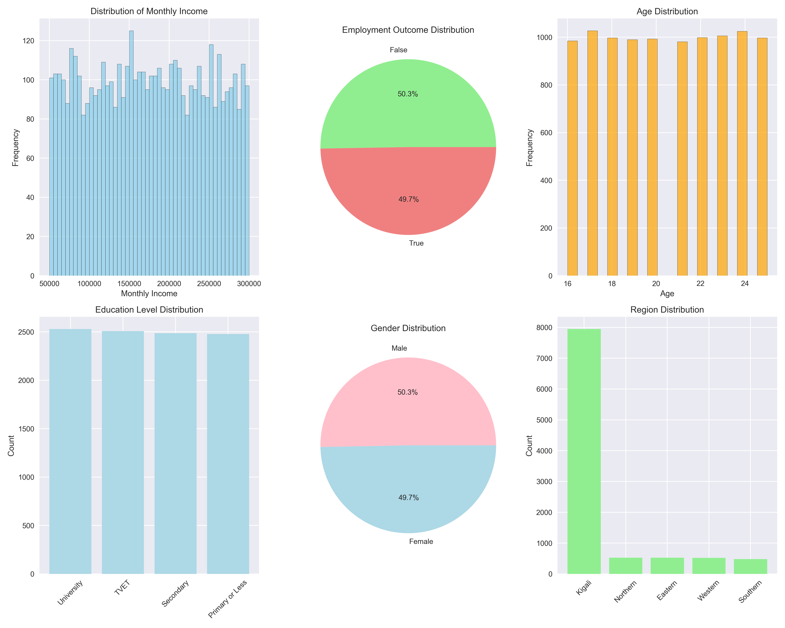
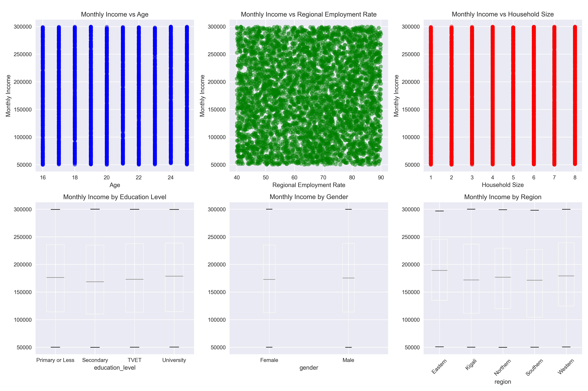

# Youth Income Predictor

## Mission

Empowering Rwandan youth with accurate income predictions using socio-economic data and machine learning. 
Built to address youth unemployment by providing actionable insights for policy makers and individuals seeking economic opportunities.

## About Dataset

The dataset captures comprehensive socio-economic factors affecting youth employment and income in Rwanda. It includes demographic, educational, regional, and economic variables from real-world youth employment surveys.

The dataset, **youth_unemployment_dataset.csv**, includes over **10,000 samples** across different regions in Rwanda, featuring:

**Personal attributes:** age, gender, education_level  
**Geographic attributes:** region, regional_employment_rate, regional_unemployment_rate  
**Economic attributes:** household_size, household_income, monthly_income  
**Skills attributes:** digital_skills_level, training_participation  

**Target:** monthly_income (in Rwandan Francs)

Designed to reflect real youth employment challenges, the data is ideal for:
- Predictive modeling using ML/AI
- Socio-economic analysis  
- Policy decision support
- Youth employment insights
- Income prediction analytics

**Link to the dataset:** [Youth Employment Status Rwanda](https://www.kaggle.com/datasets/talentsphere/youth-employment-status-rw)

## Key Visualizations for Model Training

The following visualizations were generated to understand relationships between features and guide model design:

### 1. Correlation Heatmap

The heatmap shows how strongly features like education level, digital skills, and regional employment rates are correlated with monthly income. This helped us prioritize impactful features during model training.



### 2. Monthly Income Distribution

Understanding the distribution of the target variable (monthly_income) helps in selecting appropriate loss functions and transformations for better model performance.



### 3. Linear Regression Fit: Age vs Monthly Income

Shows the relationship between age and income, revealing optimal age ranges for higher income potential and guiding feature engineering decisions.



## Model Performance

- **Best Model:** Random Forest Regressor
- **Accuracy:** 86.64% (R² Score)
- **Dataset Size:** 10,000+ samples with 25 features

- **Model Comparison:**

  - SGD Linear Regression: 58.46%
  - Decision Tree: 71.23%
  - Random Forest: 86.64%** (Chosen)

## Public API Endpoint

**Base URL:** https://youth-income-predictor.onrender.com 

**Swagger UI:** https://youth-income-predictor.onrender.com/docs 

The `/predict` endpoint accepts 10 input features and returns the predicted monthly income in Rwandan Francs.

## How to Run the Mobile App

### 1. Requirements

- Flutter 3.x
- Android Studio or VS Code
- A physical Android device or emulator to run the app
- Internet connection


### 2. App Features

- **Prediction Screen:** Accepts 10 input values and calls the backend API
- **Home Screen:** Welcome interface with navigation options
- **About Screen:** Displays model information and performance metrics
- Network call to FastAPI backend for income prediction
- Results are shown clearly with interpretation
- Form validation for all input fields

## 3. Folder Structure
```
summative/
├── linear_regression/
│   ├── multivariate.ipynb
│   ├── youth_unemployment_dataset.csv
│   ├── correlation_heatmap.png
│   ├── income_distribution.png
│   └── linear_fit_age_income.png
├── API/
│   ├── prediction.py
│   ├── requirements.txt
│   ├── best_model.pkl
│   ├── scaler.pkl
│   └── label_encoders.pkl
└── FlutterApp/
    └── youth_income_predictor/
        ├── lib/
        │   ├── main.dart
        │   ├── api_service.dart
        │   └── prediction_page.dart
        └── pubspec.yaml
```

## Quick Start Guide

### 1. Clone the Repository
```bash
git clone https://github.com/yourusername/youth-income-predictor.git
cd youth-income-predictor
```

### 2. Start the API Server
```bash
cd summative/API
pip install -r requirements.txt
uvicorn prediction:app --reload
```

### 3. Launch the Flutter App
```bash
cd summative/FlutterApp/youth_income_predictor
flutter pub get
flutter run
```

### 4. Test the System

1. Open the Flutter app
2. Navigate to "Start Prediction"
3. Fill in all required fields (age, gender, education, etc.)
4. Tap "Predict" to get income prediction results

## Key Insights from Analysis

### Most Important Features for Income Prediction:

1. **Education Level** - University education shows highest income correlation
2. **Digital Skills** - Advanced digital skills significantly boost income potential  
3. **Regional Employment Rate** - Higher employment regions offer better opportunities
4. **Training Participation** - Professional training programs increase income prospects
5. **Age** - Experience factor with optimal range around 25-28 years

### Regional Analysis:

- **Kigali:** Highest average income potential
- **Eastern Province:** Growing employment opportunities
- **Northern Province:** Focus on agriculture and rural development
- **Western Province:** Tourism and trade sectors
- **Southern Province:** Mixed economic activities

---

**A project addressing youth unemployment in Rwanda through data-driven insights and accessible mobile technology.**

# CONTACT

**Names:** Aubert Gloire Bihibindi

**Email:** a.bihibindi1@alustudent.com
